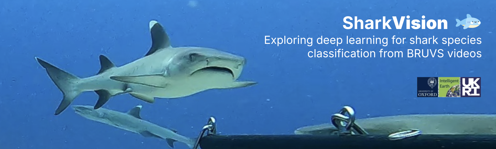

# SharkVision: Exploring deep learning for shark species classification from BRUVS videos

## Project Summary

This repository contains the code for the SharkVision project - my take on a group project completed as part of the Intelligent Earth UKRI CDT in AI for the Environment training programme. For this project, my collaborators and I were tasked with building a computer vision pipeline for processing Baited Remote Underwater Video Systems (BRUVS) videos expected to contain four different shark species. The goal was to help researchers go from raw videos to specific video frames classified as containing one or more target species.

To do this, we implemented and compared three different modelling approaches: a ResNet50 baseline, an approach based on Contrastive Language–Image Pretraining (CLIP), and an approach using a frozen DinoV2 backbone with a hyperparameter-tuned linear probe as the classifier head.

We found that our DINO model achieved an out-of-sample accuracy of 90.8%, outperforming all other approaches. For more details on the methodology and results (and some pretty niche memes), check out the project presentation here.

## Data

Due to this being an ongoing research project, and due to the sensitive nature of the data due to shark conservation concerns, the raw data for this project is not public yet. The code can be adapted for any input data - feel free to reach out with questions on this topic.

## Hyperparameters

For the DINO model, we ran a GridSearch to determine that the following hyperparameters maximised performance: 

- learning_rate: 0.0001
- batch_size: 32
- hidden_dim: 256
- dropout: 0.3
- optimizer: adamw 
- weight_decay: 0.0001

## Contents

## Contact

For any questions, email Tedi Yankov (teodor.yankov@new.ox.ac.uk). 
